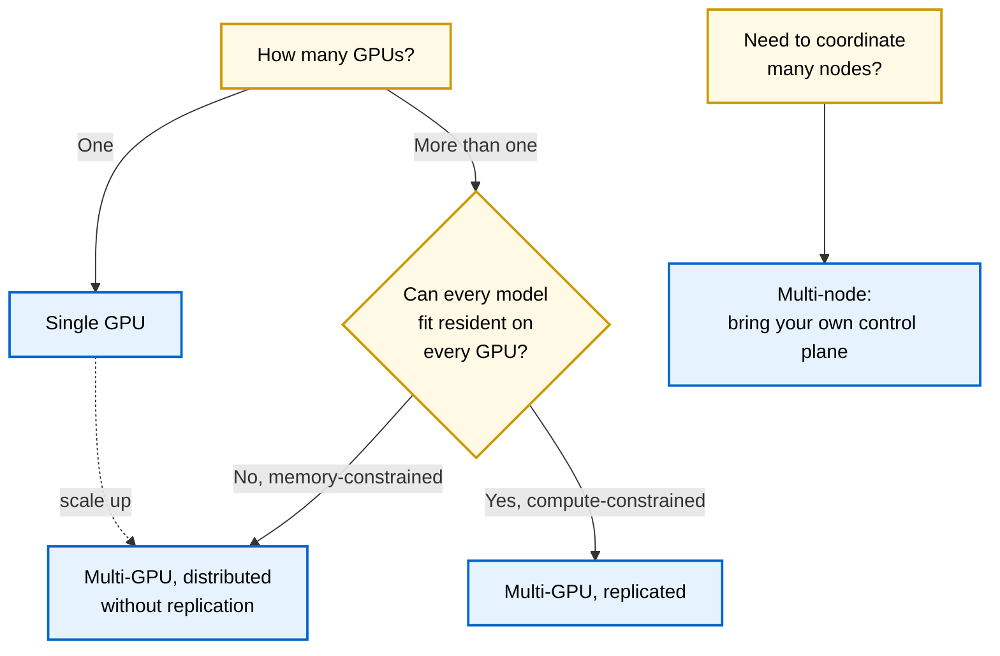
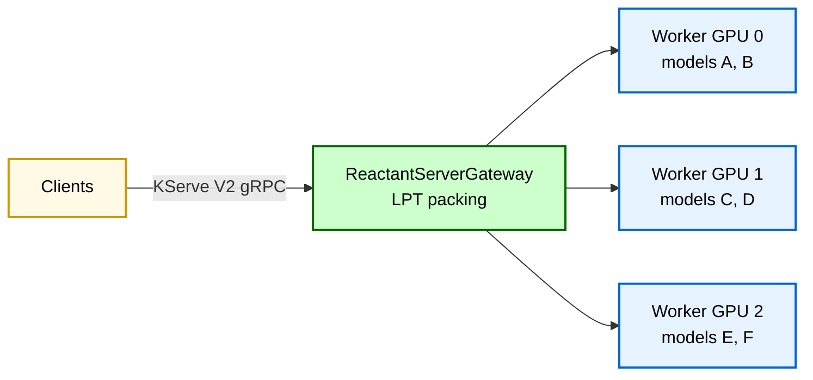
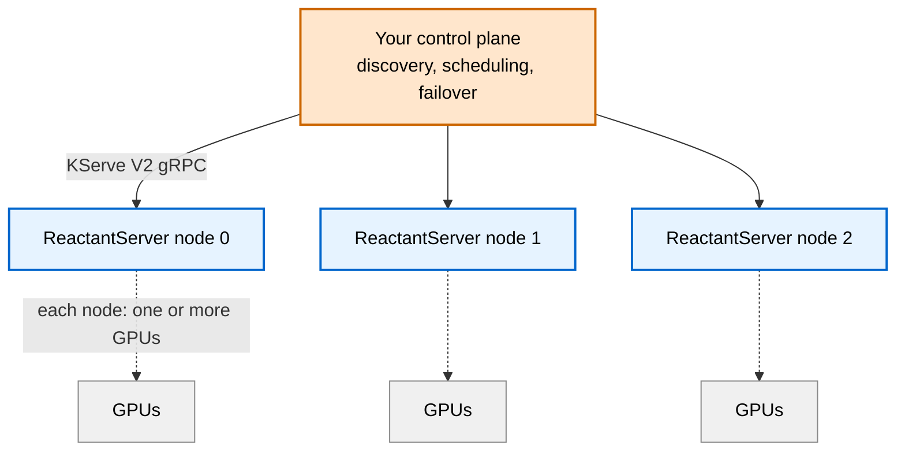

# Common Use Cases

This page describes the most common ways people deploy ReactantServer, organized by the situation you are in rather than by feature. Each section describes who the configuration is for, what it provides today, and leaves room for an example configuration.

Support for more accelerators is planned. CUDA is supported today, with CPU for development and fallback. For the authoritative and current feature details, see the [Architecture](../design/architecture.md) and the manual pages linked throughout; this page is a guide to choosing a configuration, not a substitute for the reference documentation.

## Choosing a configuration

The decision comes down to how many GPUs you have and, if more than one, whether your constraint is memory or compute.



| Situation | Configuration | Optimizes for |
|---|---|---|
| One GPU, many models | Single GPU | Fitting many models on limited hardware |
| Several GPUs, models do not all fit everywhere | Multi-GPU distributed (LPT packing) | Serving more models than any one GPU holds |
| Several GPUs, models fit everywhere, need throughput | Multi-GPU replicated | Spreading compute load across replicas |
| Many machines | Multi-node | Whatever your control plane decides |

## Single GPU

**Who it is for.** A small lab that has trained many models and wants to serve them all on one GPU without worrying about whether they fit in VRAM at once.

**What it provides today.**

- On-demand model loading (weights stay resident in host RAM, stream onto the GPU on demand, evicted LRU under a byte budget)
- Batch coalescing
- FIFO and fair (deficit-weighted, cost-aware) scheduling options
- Add, remove, and update models without restarting the server

On-demand loading is what makes this work for "a ton of models": a card serves far more models than fit in VRAM at once, paying a single host-to-device transfer on a cold call. Fair scheduling ensures that frequently called models do not starve infrequently called ones. Together they give a balanced experience where you can serve a large model library on modest hardware and trust that every model gets served.

This is the recommended starting point for small labs. It is also the conceptual foundation for the multi-GPU distributed case, which scales this same idea across cards.

**Example configuration.**

```yaml
# Example single-GPU node configuration.
# (configuration to be filled in)
```

See [Node Configuration](node_config.md) and [On-demand Weights](on_demand_weights.md) for the full surface.

## Multi-GPU, distributed without replication

**Who it is for.** A lab that has outgrown one GPU. You have several cards, but your model library is large enough that you cannot fit every model on every GPU. Your constraint is memory: there is not enough VRAM to replicate everything.

**What it provides today.**

- On-demand model loading (per GPU, as in the single-GPU case)
- ReactantServerGateway LPT packing with batch coalescing
- Add, remove, and update models without restarting the server

You can think of this as seamlessly scaling up the single-GPU case. The gateway uses LPT (longest-processing-time) packing to distribute models across GPUs, balancing memory footprint against compute load. It does not provide the same guarantees as the single-GPU fair scheduler, but the way LPT packing distributes models implicitly avoids the situation where infrequently called models are completely starved by frequently called ones: spreading models across cards by their load keeps any one card from being monopolized.



**Example configuration.**

```yaml
# Example multi-GPU distributed node configuration.
# (configuration to be filled in)
```

See [Multi-GPU Gateway](multi_gpu_gateway.md) and [Scaling to Multiple GPUs](scaling.md).

## Multi-GPU, replicated

**Who it is for.** You have several GPUs and enough memory that your models fit on more than one card. Your constraint is compute, not memory: you want to spread a model's request load across replicas for throughput.

**What it provides today.**

- ReactantServerGateway round-robin routing across replicas

**Current status and known limitation.** This is the configuration that needs the most work. It functions, but round-robin routing does not maximize batch coalescing: distributing a model's concurrent requests evenly across replicas means each replica assembles smaller batches than it could. Work is underway on a smart routing strategy that concentrates a model's concurrent requests onto one replica until it has a full batch worth in flight before moving to the next replica, which preserves coalescing across replicas. Until that lands, expect round-robin's batch-fill behavior under bursty load to be suboptimal.

If your workload is not especially bursty, or if per-request latency matters more than batch throughput, round-robin may be perfectly adequate today. If you depend on batch coalescing for throughput on a replicated model, watch for the smart routing work before relying on this configuration.

**Example configuration.**

```yaml
# Example multi-GPU replicated node configuration.
# (configuration to be filled in)
```

See [Multi-GPU Gateway](multi_gpu_gateway.md).

## Multi-node (bring your own control plane)

**Who it is for.** You are coordinating many machines, beyond what a single node supervisor handles. At this scale you typically have specific requirements (your own service discovery, scheduling policy, failover, traffic management) that a general-purpose control plane would not satisfy well.

**What the project provides.** A KServe V2 gRPC control plane service endpoint. The project deliberately does not ship a multi-node control plane of its own. The reasoning: anyone who needs multi-node coordination is usually at a scale where they would build a control plane tailored to their exact requirements, so a generic one would not fit. Instead, the project provides the interface a control plane integrates against, so you can build or adapt your own coordination layer on top of ReactantServer nodes.



**Example integration.**

```yaml
# Example showing the control plane interface / endpoint contract.
# (to be filled in)
```

See [Multi-GPU Gateway](multi_gpu_gateway.md) and [Docker Deployment](docker.md) for the node interface, ports, and health/metrics endpoints a control plane would use.

## Summary

The common path is to start on a single GPU with on-demand loading and fair scheduling, then scale to multi-GPU distributed (LPT packing) as the model library outgrows one card. Replicated multi-GPU is for compute-bound workloads and currently uses round-robin routing, with smarter coalescing-aware routing in progress. Multi-node is for users who bring their own control plane and integrate against the provided gRPC interface.

Feature support evolves; check the linked manual and design pages for the current state rather than relying on this overview alone.
