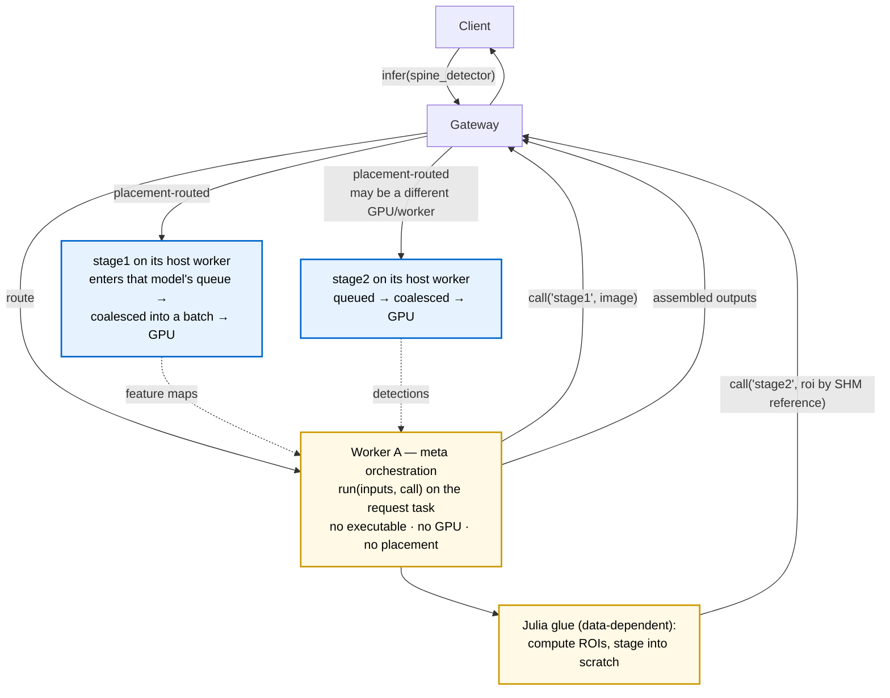

```@meta
CurrentModule = ReactantServer
```

# Meta Models

A meta model is a bundle whose `model.jl` orchestrates *other* models with ordinary Julia in
between, rather than wrapping a single compiled executable. It exists for the logic `torch.export`
cannot trace: data-dependent control flow, loops whose bounds depend on a tensor's contents, or a
pipeline where stage two's inputs are computed from stage one's outputs. The server runs the
orchestration as a normal inference request, so a meta model is addressable by clients under its
own name exactly like any other model.

If your model is a single traced graph, use a plain bundle with optional pre/post hooks (see
[Bundles & model.jl](bundles.md)). Reach for a meta model only when the glue between sub-models
is real program logic.

## Anatomy

A meta bundle is a directory with a `manifest.yaml` and a `model.jl`, and no compiled artifact or
weights of its own. The manifest declares `kind: meta`, lists the models the orchestration is
allowed to call, and must carry `client_inputs`/`client_outputs` (there is no executable to infer
the client-facing I/O from):

```yaml
format_version: "2.0"
name: spine_detector
kind: meta
meta:
  calls: [spine_detector_stage1, spine_detector_stage2]
client_inputs:
  - {name: IMAGE, dtype: f32, shape: chw, dims: {c: 3, h: 1024, w: 1024}}
client_outputs:
  - {name: BOXES, dtype: f32, shape: nb, dims: {b: 4}}
```

The `model.jl` calls [`register_meta_model`](@ref) with the orchestration function:

```julia
register_meta_model("spine_detector"; run = function (inputs, call)
    feats = call("spine_detector_stage1", inputs)            # backbone
    rois  = compute_rois(feats)                              # ordinary Julia, data-dependent
    out   = call("spine_detector_stage2", rois)              # head
    return [ReactantServer.NamedTensor("BOXES", out[1].data)]
end)
```

`run` has the form `run(inputs::Vector{NamedTensor}, call) -> Vector{NamedTensor}`. The injected
`call(model_name, inputs)` invokes another model and returns its outputs as
[`NamedTensor`](@ref)s. The callee must appear in `meta.calls`; calling an undeclared model is a
loud error. The loader also rejects a meta bundle whose `model.jl` calls `register_model` instead
of `register_meta_model`.

## Routing is transparent to the author

The same `model.jl` runs unchanged whether the worker is alone or part of a fleet. `call`
dispatches in-process through the local scheduler on a single-worker deployment, and over the
loopback gateway in multi-worker mode, so a sub-model that lives on another GPU is reached without
the author writing any routing. Write the orchestration as if every model it calls is local.

## Where it runs, and how it interacts with batch scheduling

The orchestration has no executable, so it is never itself scheduled or batched onto a GPU. Its
`run` function executes on the gRPC request task, off the worker's serial GPU dispatch loop, in the
same place the regular pre/post hooks run. While it waits on a sub-call it yields cooperatively, so
a meta in flight never blocks the dispatch loop or holds the GPU.

Each sub-call, by contrast, is an ordinary inference request. It lands in the target model's
per-model queue on whichever worker hosts that model and is coalesced into a batch there exactly
like external traffic. A meta's `stage1` call batches together with other clients' `stage1` calls;
the meta gets no special batching and contributes to the normal coalescing like any caller. Under
the `edf` discipline an in-flight sub-call carries the meta's remaining deadline budget, so it is
served ahead of fresh full-budget requests to the same model (see the discipline notes in
[Node Configuration](node_config.md)); under `fifo` it is served in arrival order.

## How it interacts with model placement (it doesn't)

A meta model holds no weights and no compiled executable, so the gateway's `lpt_packing` placement
does not place it on any GPU. It has no residency and no device-memory footprint; it is "ready" as
soon as it is loaded, and its only cost while serving is a request task.

The models a meta calls are placed independently, by their own memory and compute cost. A meta does
not pin, co-locate, or otherwise influence where its sub-models live, and the placement logic does
not need to know which models are reached through a meta. The consequence is the tradeoff worth
understanding: a meta's sub-calls are routed to wherever each target model currently lives, which
may be a different GPU and worker than the meta's host and than each other. That keeps authoring
fully placement-agnostic, at the cost that sub-calls traverse the loopback gateway and may hop
across workers. The decoupling is deliberate; the system does not currently force a meta's stages
onto a single GPU to save that hop.

## Fan-out and shared-memory scratch



By default a sub-call's input tensors are serialized inline over the loopback transport. For a
large input, for example a 50 MB ROI feature tensor handed from the glue to `stage2`, that inline
copy dominates the cost. The injected `call` exposes a scratch allocator for this case:

```julia
roi = call.scratch((7, 7, 256, k), Float32)   # pool-backed buffer in multi-worker mode
fill_rois!(roi, feats, boxes)                  # write directly into it
out = call("spine_detector_stage2", [ReactantServer.NamedTensor("ROI_FEATS", roi)])
```

A buffer returned by `call.scratch` lives in a shared-memory region the destination worker can read
directly, so the sub-call references it by region and offset instead of copying it over the wire.
In single-worker mode `call.scratch` returns a plain heap array and the sub-call passes in-process,
so the same `model.jl` is correct either way. It is strictly opt-in: a meta that never calls
`scratch` behaves exactly as before, with inputs inlined.

Two rules make this safe and efficient, both enforced:

- **Request every buffer in one `call.scratch` call.** Pass a vector of `dims => T` pairs to get
  several buffers at once; they are carved from a single contiguous block. Calling `scratch` more
  than once per request is rejected. This keeps the buffer pool deadlock-free, since a meta holds at
  most one block and never acquires another while holding one.
- A scratch buffer must reach the sub-call as a contiguous array. A reshape or contiguous prefix is
  fine; a strided view or a copy falls back to the inline path.

## Constraints

- **A meta model may not call another meta model.** This is validated at load and is what keeps the
  fan-out free of cross-worker cycles. Compose depth-one pipelines only.
- **Compute-only metas are allowed.** A meta may declare an empty `meta.calls` and do all its work
  in Julia, calling no sub-models at all. This is useful for logic that is awkward to express as a
  traced graph but needs no separate executable.
- **Deadlines propagate.** When a request carries a remaining-budget timeout, the meta passes the
  shrinking budget to each sub-call and stops issuing further stages once the budget is gone, so an
  abandoned request does not keep consuming GPU through its pipeline. See the deadline behavior in
  [Node Configuration](node_config.md).

## See also

- [Bundles & model.jl](bundles.md) for the plain (non-meta) bundle path and pre/post hooks
- [Multi-GPU Gateway](multi_gpu_gateway.md) for how the gateway routes and places models
- [Node Configuration](node_config.md) for the scheduling disciplines, including `edf`
- [`register_meta_model`](@ref) in the API reference
